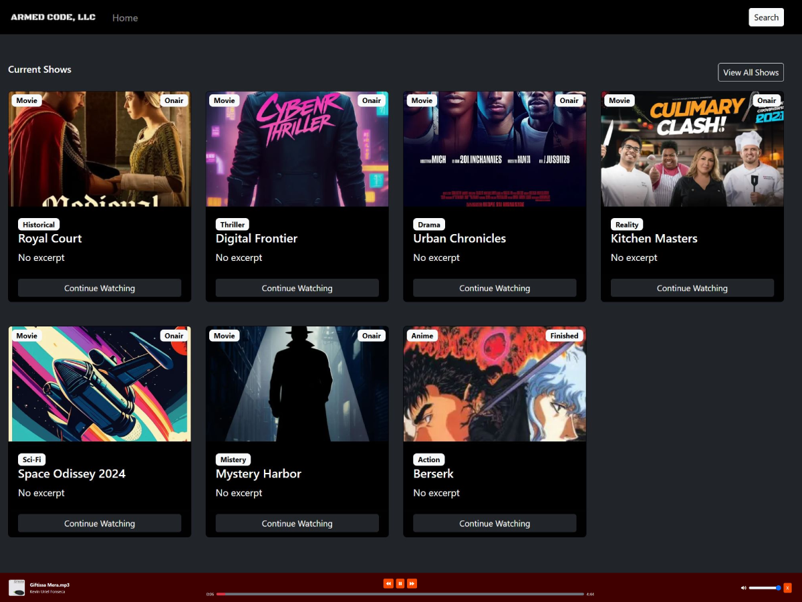

# Welcome to Armed Code, LLC



This is an [Armed Code, LLC](https://armedcodellc.com/) project bootstrapped with [`create-next-app`](https://github.com/vercel/next.js/tree/canary/packages/create-next-app).

## Getting Started

- Visit our [Learn Next.js](https://nextjs.org/learn) course to get started with Next.js.
- Visit the [Next.js Showcase](https://nextjs.org/showcase) to see more sites built with Next.js.

---

## Standards for inputs and forms based on onSubmit={} or action={} attributes

### Client form inputs using onSubmit={}

```jsx
import { useState } from 'react';

const [formData, setFormData] = useState({
    exampleValue = ``,
})

const [btnText, setBtnText] = useState("Submit");
const { exampleValue } = formData;

const submitForm = async (e) => {
    e.preventDefault();
    setBtnText("Processing...");
    const res = await fetchurl(`/API_ROUTE`, "METHOD", "no-cache", {
        ...formData,
        // otherFields; examples:
        // secondaryValueNotControlledByUserOrForm: 'yada=yada'
    });
    if(res.status === "error") {
        toast.error(res.message, "bottom");
        setBtnText("Submit");
        return; // Stop propagation
    }
    setBtnText("Submit");
    toast.success("Data sent", "bottom");
    resetForm();
    router.push(`/PAGE_TO_REDIRECT_TO`);
}

const resetForm = () => {
    setFormData({
        exampleValue = ``,
    })
}

return (
    <form onSubmit={submitForm}>
        <label htmlFor="exampleId" className="form-label" />
        <input
            id="exampleId"
            name="exampleName"
            value={exampleValue}
            onChange={(e) => {
                setFormData({
                    ...formData,
                    exampleValue: e.target.value
                })
            }}
            type="text"
            className="mb-3"
            required
            placeholder=""
        />
        <button
            type="submit"
            className="">
                {btnText}
        </button>
        <button
            type="reset"
            onClick={resetForm}
            className=""
        >
            Reset
        </button>        
    </form>
)
```

### Client form inputs  using action={}

```jsx
import FormButtons from "/PATH_TO_FormButtons_COMPONENT"

const submitForm = async (formData) => {
    "use server"

    const formData = {
        exampleValue: formData.get("exampleName"),
    }

    const res = await fetchurl(`/API_ROUTE`, "METHOD", "no-cache", {
        ...formData,
        // otherFields; examples:
        // secondaryValueNotControlledByUserOrForm: 'yada=yada'
    });
    revalidatePath(`/PAGE_TO_REDIRECT_TO`);
    // OR
    revalidateTags(`/PAGE_TO_REDIRECT_TO`);
}

return (
    <form action={submitForm}>
        <label htmlFor="exampleId" className="form-label" />
        <input
            id="exampleId"
            name="exampleName"
            defaultValue="WHATEVER"
            type="text"
            className="mb-3"
            required
            placeholder=""
        />
        <FormButtons />
    </form>
)

// FormButtons.js COMPONENTs
"use client"

import { useFormStatus } from "react";

const FormButtons = ({ }) => {
    const { pending } = useFormStatus();
    
    return (
        <>
            <button
                type="submit"
                className=""
                aria-disabled={pending}
                disabled={pending}
            >
                {pending ? "Processing..." : "Submit"}
            </button>
            <button
                type="reset"
                className=""
            >
                Reset
            </button>
        </>
    );
}

export default FormButtons;
```